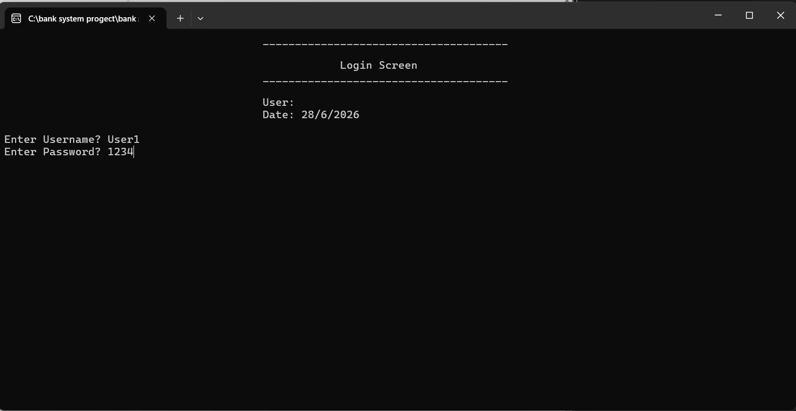
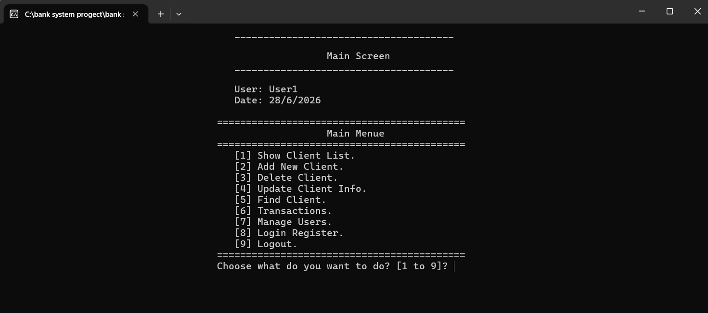
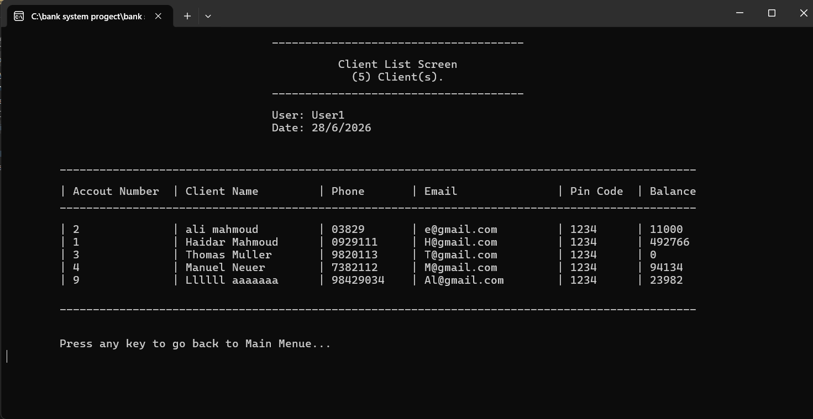
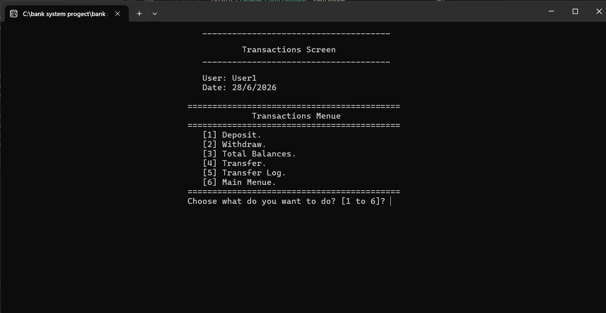
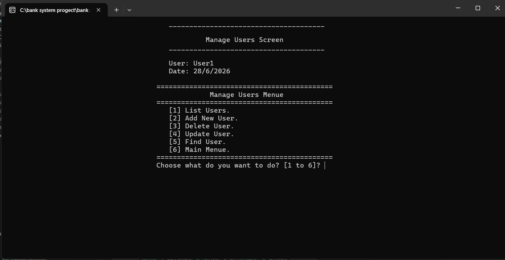
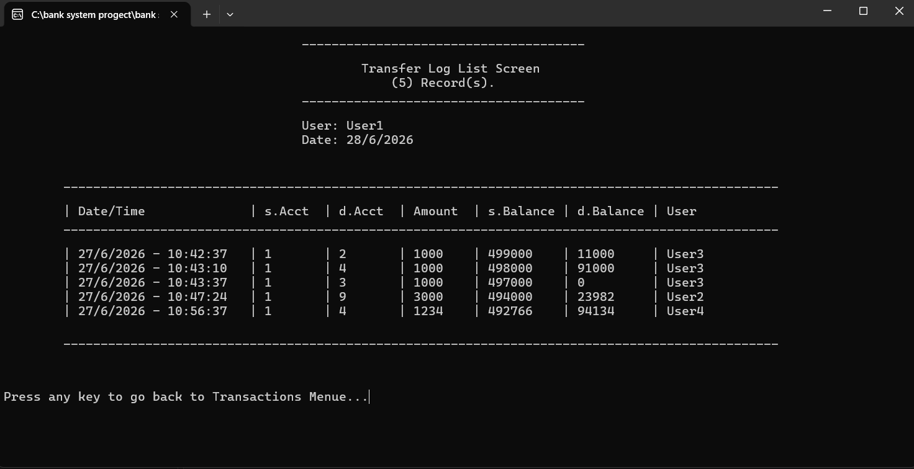

# Bank Management System

A **console-based Bank Management System** developed in **C++** using **Object-Oriented Programming (OOP)** principles.

This project was built from scratch as a personal learning project to apply advanced OOP concepts in a realistic banking scenario. The application manages clients, users, banking transactions, authentication, authorization, and logging while storing data in text files.

---

# Project Overview

The system simulates the daily operations of a small bank through a menu-driven console application.

It provides different management modules, supports user authentication with permissions, performs financial transactions, and keeps records of login activities and money transfers.

The project focuses on software design, code organization, and object-oriented architecture rather than graphical interfaces.

---

# Features

## Client Management

* View all clients
* Add new clients
* Update existing clients
* Delete clients
* Search for clients
* Store client information in text files

---

## Banking Operations

* Deposit money
* Withdraw money
* Transfer money between accounts
* Display total balances
* Record every transfer operation
* View transfer history

---

## User Management

* List users
* Add new users
* Update users
* Delete users
* Search users
* Permission-based access control

---

## Authentication & Security

* Username and password login
* Maximum of three failed login attempts
* Login history logging
* Password encryption before storing
* Permission checking before accessing protected screens

---

## Data Storage

The application stores its data using text files.

Example files include:

* Clients.txt
* Users.txt
* LoginRegister.txt
* TransferLog.txt

This project intentionally uses file storage to demonstrate file handling and object serialization concepts without relying on a database.

---

# Object-Oriented Programming Concepts

This project demonstrates practical usage of:

* Classes and Objects
* Encapsulation
* Inheritance
* Composition
* Static Classes
* Enumerations
* Properties
* File Handling
* Separation of Concerns
* Reusable Components

---

# Project Structure

The application is organized into independent modules.

Examples include:

* Login
* Main Menu
* Client Management
* Transactions
* User Management
* Transfer Logs
* Login Register
* Validation
* Utilities
* Date Handling
* String Utilities

Utility classes such as **Date**, **String**, and **Utility** were originally developed during programming practice and later reused and extended inside this project to improve code reusability.

---

# Technologies Used

* C++
* Object-Oriented Programming (OOP)
* Standard Template Library (STL)
* File Streams
* Text File Storage
* Microsoft Visual Studio

---

# How to Run

1. Clone the repository.

2. Open the solution file in Visual Studio.

3. Build the project.

4. Run the application.

---

# Future Improvements

Possible future enhancements include:

* Replace text files with SQL Server or SQLite.
* Add password hashing instead of simple encryption.
* Build a graphical interface using Qt or C#.
* Improve exception handling.
* Export reports to PDF.
* Multi-language support.
* Unit testing.
* Transaction rollback.
* Audit system.

---

# Screenshots

## Login Screen

---

## Main Menu

## Clients Screen

---

## Transactions

---

## User Management

---

## Transfer Log

---

# What I Learned

During this project I practiced and improved my understanding of:

* Object-Oriented Programming
* Designing large C++ projects
* File handling
* Authentication and authorization
* Modular software architecture
* Code reusability
* Banking transaction logic
* Organizing applications into multiple classes

---

# Author

Developed independently as a personal educational project.

